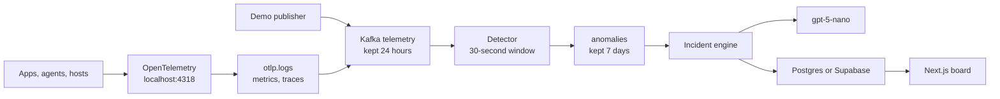

# AI Incident Detector

Every 90 seconds a checkout starts failing, a billing agent retries `charge_card`, and a web node pins its CPU. A 30-second window catches each one. `gpt-5-nano` writes two sentences. One incident lands on the board.

Kafka keeps the stream. Postgres, or Supabase when you set the keys, keeps the incident: the row, the summary, and at most five error lines. The board is a Next.js app.



The demo publisher is what fills the board today. A real service joins the same path by exporting OTLP to `localhost:4318`. The collector is already listening.

## What you see

Open [http://localhost:3000](http://localhost:3000) after the two commands below. The left column is the live list. The right column is the incident: severity, the two-sentence summary, the measured value, and the sample lines that justified the row.

Three counts sit in the header. Click one to filter. **Acknowledge** and **Resolve** write straight back to the incident row.

| Service | Signal | The rule |
| --- | --- | --- |
| `billing-agent` | `tool.retry.charge_card` | The same tool fails 5 times inside 30 seconds |
| `checkout` | `http.error_ratio` | Error ratio above 5% after at least 10 requests |
| `web-node` | `cpu.utilization` | The last 3 CPU samples are all at or above 80% |

The quiet stretch lasts about a minute. The spike lasts about 16 seconds. The first rows show up roughly 15 seconds after Kafka is ready.

## What the model is doing

`gpt-5-nano` runs once, after a rule has already fired. It receives the service, the signal, the number, five log lines, and the last three incidents for that same pair. It writes what crossed the threshold and one likely cause. If an older row matches, it reuses that cause.

While the incident stays open, later breaches append evidence and keep the first summary. A new model call happens after you resolve the row and the rule fires again. The summary is a note for the person on call. Restarts, rollbacks, and status changes stay on the buttons in the board.

With `OPENAI_API_KEY` unset, the summary is one fixed sentence and the page says `template`.

## Run

```bash
docker compose up --build
```

```bash
cd dashboard
npm install
npm run dev
```

Copy `.env.example` to `.env` and set `OPENAI_API_KEY` if you want the model to write the summaries. The key stays in `.env`, which is gitignored.

Stop the board with Ctrl-C. Stop the pipeline with Ctrl-C, then `docker compose down`. The engine also serves an older page at [http://localhost:8080](http://localhost:8080). The Next.js app is the one to use.

## Where a log goes

| | Kept for | What lands there |
| --- | --- | --- |
| `telemetry` | 24 hours | Every log, metric, and tool call |
| `anomalies` | 7 days | One message when a rule trips |
| `incidents` | until you delete it | One open row per service and signal, plus at most 5 error lines and 2 other samples |

A second anomaly for an open service and signal updates that row. The unique index stops a duplicate. Resolving the row frees the slot, so the next breach opens a new incident.

The rules live in `aid/windows.py`, in the detector's memory. Restarting `detect` empties the window. Rows already written stay.

## Put the board on Vercel

Vercel hosts the app in `dashboard/`. Kafka stays with `docker compose` on a machine you control. The deployed board reads the same tables from Supabase.

1. Run `supabase/migrations/001_incident_state.sql` in the Supabase SQL editor.
2. Set `SUPABASE_URL` and `SUPABASE_SERVICE_ROLE_KEY` in `.env`, then restart compose. New incidents land in that project.
3. Import this repo at [vercel.com/new](https://vercel.com/new). Set the root directory to `dashboard`.
4. Add those same two variables in the Vercel project. Leave off any `NEXT_PUBLIC_` prefix. The service role bypasses row level security, so it stays on the server.

```bash
cd dashboard
npx vercel
npx vercel --prod
```

With the Supabase keys unset, `npm run dev` keeps reading the local engine.

## Point a real service at it

```bash
export OTEL_EXPORTER_OTLP_ENDPOINT=http://localhost:4318
```

The collector writes Kafka. The normalizer re-keys each record by `service.name` onto `telemetry`. GenAI spans that carry `gen_ai.tool.name` become tool-call events, which is how a real agent shows up as retries. Host CPU from the collector becomes `cpu.utilization`.

## Scaling

Scale the topic that is big. Keep the database on the topic that is small.

| Topic | Key | Partitions | Who reads it | How you scale |
| --- | --- | --- | --- | --- |
| `otlp.logs`, `otlp.metrics`, `otlp.traces` | none required | 6 | `normalizer` | Add normalizer processes. They are stateless. |
| `telemetry` | service name | 12 | `detector` | Add detectors, up to the partition count. |
| `anomalies` | `service\|signal` | 3 | `incident-engine` | One process is enough until the model or Postgres is the slow part. |

Every record for `billing-agent` uses that service as the key, so the whole service lands on one partition and one detector owns its 30-second window. That is why the window can live in memory. Raise `TELEMETRY_PARTITIONS` before the topic is created. More detectors than partitions sit idle. One detector can own several partitions.

A detector restart starts the window empty. Open incidents stay open. If one service outgrows a single consumer, split the key, for example `billing-agent-0`. If the engine falls behind, add anomaly partitions and engine copies. Watch lag on `telemetry`. Lag means the detectors are slower than the publishers.

`PLAN.md` is the longer study path, including Supabase Compute.
